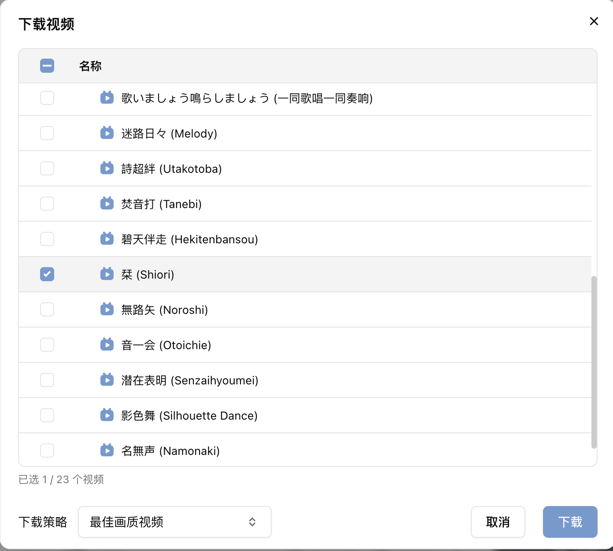
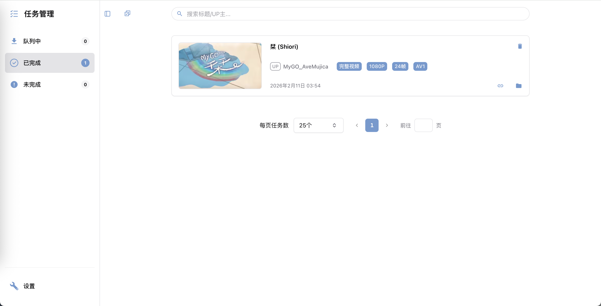

  

**SakiDown**是一个基于Chrome Manifest V3标准的哔哩哔哩视频下载和管理插件。该项目有以下亮点：
1. **流式合并算法**：采用原生JavaScript实现了DASH音视频流的解封装与无损合并，配合OPFS存储技术，解决了ffmpeg.wasm在合并大文件时遇到的内存墙问题。
2. **透明隐私保护**：SakiDown承诺不收集任何用户数据，除Bilibili官方接口外无任何网络请求。代码完全开源且未混淆，逻辑清晰透明。用户可随时查阅或使用AI工具辅助审计源代码，确保数据安全。
3. **数据安全**：坚持“本地优先”原则，所有运行数据均存储于用户本地。可以完整导出已完成任务的json数据。
4. **极简交互体验**：集成于浏览器，无需额外登录账号。下载单个视频，在打开视频页面后只需要点击2次鼠标（批量下载点击3次）。可以不点击Chrome插件图标完成插件的全部操作。
5. **支持全面**：开箱即用，支持非DRM加密的个人投稿/番剧/课堂，完整支持合集/播放列表/稍后再看。支持封面和弹幕下载。
## 安装
### 1. 下载项目文件
#### 方法一：git clone（推荐）
```bash
git clone https://github.com/weiyunjun/sakidown.git
```
#### 方法二：点击下载
在GitHub页面点击Code -> Download ZIP下载并解压。
### 2. 在浏览器中加载
本项目基于原生JavaScript开发，**开箱即用**，无需任何构建流程。
#### Chrome浏览器：
1. 打开浏览器，打开设置 - 扩展程序。
2. 开启开发者模式。
3. 选择：加载未打包的项目程序。
4. 选择项目文件夹。
#### Edge浏览器：
1. 打开浏览器，打开设置 - 扩展。
2. 开启开发人员模式。
3. 选择：加载解压缩的扩展。
4. 选择项目文件夹。
## 更新
### 方法一：git更新（推荐）
在项目文件夹内打开终端，执行以下命令即可同步最新代码：
```bash
git pull
```
然后在浏览器的扩展管理页面点击刷新或更新图标即可。
### 方法二：重新下载
删除旧文件夹，重新下载并解压到原文件夹（需要确保文件夹名称一致，否则不会被Chrome视为同一个插件）。
### 注意事项
- 更新插件或者日常使用时，请不要移除插件，移除操作会直接清空插件数据！
- 重装系统且清除系统盘数据通常会清除浏览器数据，请提前做好数据导出工作。
## 使用
### 下载
#### 1. 刷新网页
- 如果哔哩哔哩网页是在安装插件之前打开的，那么需要**刷新**网页才可以使插件生效。
- 你也可以打开一个新的哔哩哔哩视频网页。
#### 2. 下载入口
- 有两种方式唤起下载面板：
  - 点击视频页面左下方的下载按钮。
  - 在浏览器地址栏点击插件图标，在弹出的页面中点击下载视频选项。
#### 3. 选择下载内容

- **默认选择**：会勾选当前页面的视频，插件初始会默认下载最佳画质的视频，不下载封面，不下载弹幕。
- **批量选择**：在弹出的列表中，勾选你想要下载的视频。支持列表顶部的一键全选。
- **策略切换**：在列表底部，你可以快速切换“下载策略”（例如：仅下载音频、最佳画质等）。关于策略的详细配置见下文。
#### 4. 下载通知
- 在开始下载后，页面底部会出现一个通知横幅，你可以点击横幅的任务管理按钮，进入任务管理界面，掌控下载进度和更多内容。
- 下载会自动在后台完成，不需要保持当前网页开启（只需要保证浏览器开启）。
#### 5. 任务管理

- 打开任务管理后，在左侧有3个标签页：
  - **队列中**：当前正在下载以及等待下载的任务。你可以查看视频信息、下载状态、下载速度等信息，也可以手动取消任务。
  - **已完成**：以及完成的任务。你可以点击标题播放视频/音频，打开up主的主页，复制视频链接，打开视频所在文件夹。
  - **未完成**：因为各种原因下载失败的任务以及手动取消的任务。在这里会显示报错信息，可以复制视频链接，也可以重试任务或删除任务。
- 你可以批量管理任务，也可以搜索任务。2个操作可以同时进行。
### 设置
遵循最小权限原则，目前只支持在哔哩哔哩网页中或任务管理页面打开设置功能。
#### 通用
- **视频页面显示下载按钮**：开启后，在支持的视频页面的左下角，会加载一个下载按钮。默认开启。
- **任务间隔**：前一个任务结束后，下一个任务需要等待的时间。默认5秒。防止请求过快被风控。
#### 个性化
- **主题色**：默认提供Saki（蓝）和Anon（粉）2种主题色，你可以自行配置主题色（需要填入主题色名称和颜色码）。
- **任务完成音效**：可以选择是否开启，可以自行添加本地音效文件（请不要添加文件名包含春日影的音效）。默认关闭。
#### 下载策略
- **设计目的**：下载策略的初衷是为了简化批量下载的流程，应对不同下载场景的改变。
- **设置项**你可以通过预先设置偏好（是否下载某些资源，视频的偏好画质，视频的偏好编码，是否合并音频流和视频流），来处理复杂的下载任务。
- **使用方法**：你可以在下载视频界面切换下载策略。初始一共有3个下载策略：最佳画质视频、最佳画质视频+封面+弹幕、纯音频。默认会选择最佳画质视频。
- **用户权限**：最佳画质会选择当前用户权限可以下载的最高画质视频。例如非大会员无法下载4K分辨率的视频或者仅限大会员观看的番剧。
- **画质选择**：你可以指定最佳画质外的偏好的画质，分为首选画质和次选画质。当没有符合首选画质和次选画质的视频流时，会自动选择最佳画质。
- **编码选择**：你可以指定偏好的视频编码，默认首选编码是AV1，次选编码是HEVC。前者体积较小，压缩率更高。现代播放器支持哔哩哔哩的所有3种编码格式（AV1 HEVC AVC）。
- **附件下载**：支持视频封面下载，支持XML弹幕下载。暂时不支持其他格式的弹幕文件下载。
- **空壳任务**：你可以不下载任何内容，只保存视频元数据，相当于变相的快速批量收藏，对哔哩哔哩服务器友好。
#### 数据导出
- **导出格式**：支持导出已完成的任务数据，格式为`.json`。
- **数据结构**：任务数据包括视频的元数据（`task.metadata`），下载该视频的下载策略配置（`task.preference`），该视频的下载状态（`task.status`）。
- **分卷导出**：一次最多导出10000条数据，如果数据大于10000条，会分为多个`.json`文件导出。
- 备注：导入功能开发中，敬请期待。
## 已知问题与局限性
尽管我已经努力测试覆盖所有可能的情况，但受限于自身技术能力和Chrome Manifest V3扩展的沙箱机制的双重限制，本项目在部分场景下仍存在以下已知局限：
### 1. 平台与架构限制
由于Manifest V3严格的安全策略与生命周期管理，部分功能在实现上存在物理瓶颈：
- **无法“真”暂停**：由于流式合并算法（DASH -> MP4）涉及复杂的二进制缓冲区管理，目前的架构不支持中途暂停下载。点击“取消”即意味着销毁任务。
- **UI交互限制**：Chrome限制了扩展程序对原生“下载栏”的控制权，使得静默通知难以真正实现。
### 2. 性能瓶颈
本项目采用Service Worker ↔ Offscreen ↔ Web Worker的三层通信架构。
- **高延迟IO环境**：当下载目标路径位于NAS且通过无线网络传输时，IO写入速度可能低于下载流的积压速度。
- **后果**：这可能导致内存缓冲区溢出或数据写入不完整。
- **建议**：在下载高码率视频时，建议优先保存至本地硬盘。
### 3. 设计理念
SakiDown采用了策略优先的设计哲学，这可能不符合每次下载手动选画质的用户的习惯：
- **自动化决策**：为了优化批量下载，插件强制通过预设的下载策略来决定下载内容。
- **无单独选项**：不提供单次任务的下载选项。所有选项只能在下载策略中调整。
### 4. 项目成熟度
- **可维护性**：本项目是我在学习JavaScript一段时间后的练习性质的作品，主要角色更接近传统项目中的架构师+产品经理+测试。大部分具体业务代码由AI生成。虽然核心功能稳定，但可维护性有待于我对业务代码的进一步学习。
- **边缘情况**：目前的测试覆盖率主要集中在主流场景。在极端网络环境或特定硬件配置下，可能会出现未定义的行为。欢迎提交Issue反馈。
## 致谢
SakiDown的开发工作，是出于对二创社区的爱，一时冲动下开启的。如果没有以下存在，SakiDown完全没机会坚持到开源的这一天：
- **哔哩哔哩It's MyGO!!!!! & Ave Mujica二创社区**：谢谢你们带给我的美好回忆。对所有二创作者，致以最深，最深的敬意。
- [bilibili-API-collect](https://github.com/SocialSisterYi/bilibili-API-collect/)：谢谢你提供的API的详细文档，没有它，我会无从下手。
- [mp4box](https://github.com/gpac/mp4box.js/)：虽然代码部分无法提供直接参考，但在开发初期，`mp4box -info`在测试和验证DASH流合并算法时提供了巨大的帮助。
- [hakadao](https://github.com/hakadao/)：感谢你的bewlybewly插件，从你这里我知道了It'MyGO!!!!!这部作品。你的遭遇，让我鼓起勇气真正去在乎我爱的人。
- 我的家人和Steam家庭组的朋友。谢谢你们包容我像疯子一样的开发状态，还有...让我白嫖游戏。

## 第三方依赖与素材
- **MD5算法**
    * **来源**：JavaScript implementation of RSA Data Security, Inc. MD5 Message Digest Algorithm.
    * **作者**：Paul Johnston et al.
    * **协议**：BSD License
    * 注：源代码已包含完整版权声明。
- **默认音效**
    * **文件**：`assets/default.wav`
    * **来源**：[Directory Audio - Email Notification Gentle Ping](https://directory.audio/sound-effects/interface-ui/38142-email-notification-gentle-ping)
    * **协议**：CC0 1.0 Universal (Public Domain)
## 免责声明
- **软件许可**：本项目基于MIT License开源。在遵守协议的前提下，你可以自由地使用、修改或分发本软件。
- **内容版权**：本软件仅作为下载工具。用户使用本软件下载的任何内容（包括但不限于视频、音频、封面），其版权归原作者或平台所有。
- **使用责任**：用户需自行承担因使用本软件下载、传播版权内容而产生的任何法律责任。开发者不对用户的具体使用行为负责。